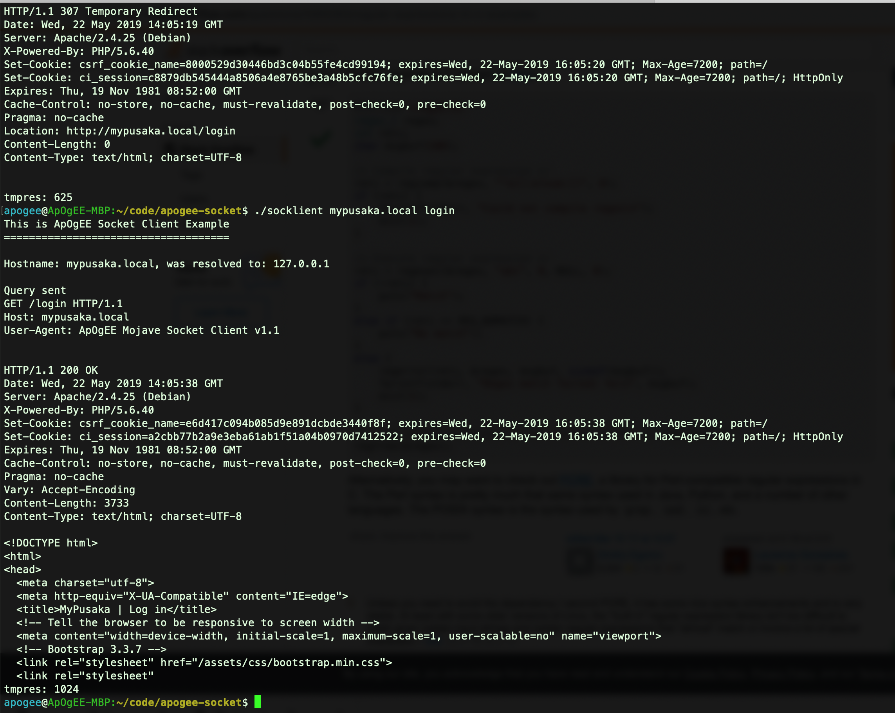

## ApOgEE C Socket Programming on MacOS Mojave

This is basically an exercise/example for me to remember the code I wrote.

7 years ago, I made a simple C socket programming code to be [compiled on MinGW](https://github.com/ApOgEE/mingw-c-socket) and run in Windows. 

Today, I would like to try doing the code again. But this time I will write the code to compile and run on MacOS Mojave.

### Compiling

To compile the code, simply type:
```
make clean all
```

### Running The Program

```
./socklient [DOMAIN] [PAGE]
```



OK, That's all for now... Enjoy!
